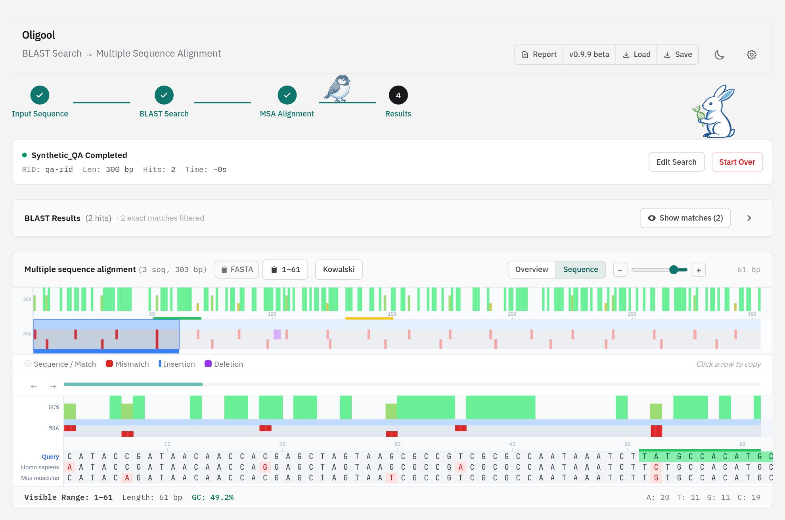
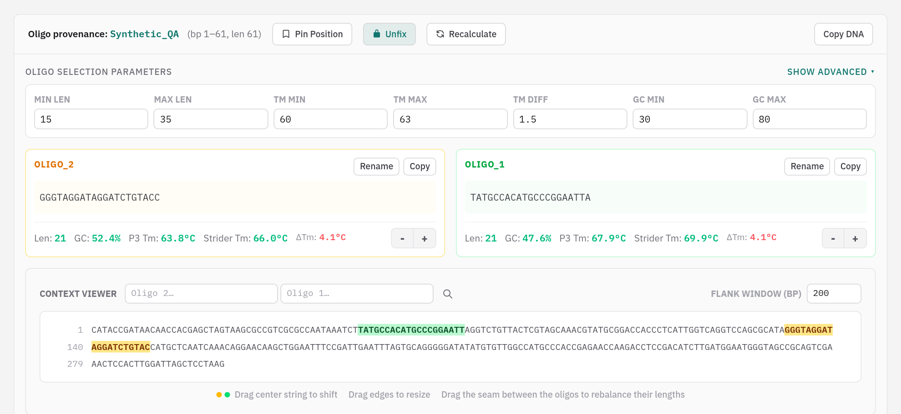
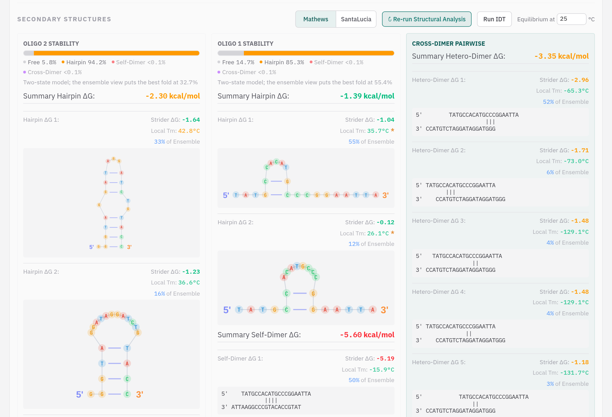
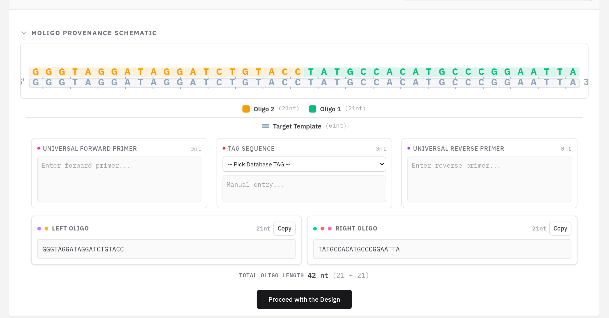
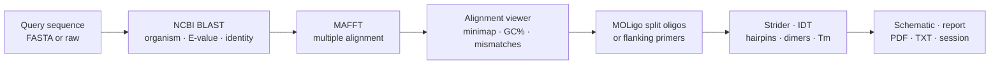
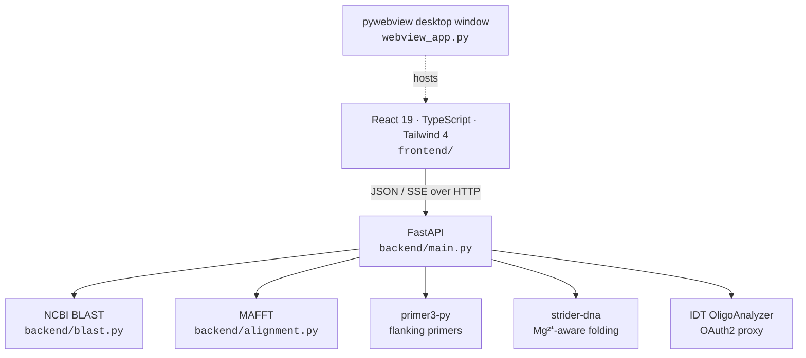

<div align="center">


# Oligool

**From a query sequence to checked oligos: BLAST, align, pick a conserved region, design and QC.**

[](https://oligool.ubch.sci.muni.cz/)
[](https://github.com/KowalskiBio/Oligool/releases/latest)

[](backend)
[](frontend)
[](frontend)
[](frontend)
[](frontend)
[](webview_app.py)
[](LICENSE)

[**Features**](#features) · [**Download**](#download) · [**Run from source**](#run-from-source) · [**How it works**](#how-it-works) · [**Architecture**](#architecture)

<br />

<picture>
  <source media="(prefers-color-scheme: dark)" srcset="docs/images/overview-dark.png" />
  
</picture>

</div>

<br />

Oligool takes a query sequence, finds its homologs with **NCBI BLAST**, aligns them with **MAFFT**, and shows the alignment in an interactive viewer where conserved regions stand out. Pick a region and Oligool designs **MOLigo** split oligos or **flanking PCR primers** on it, then checks every oligo's hairpins and dimers with the native **Strider** engine and, if you want, **IDT OligoAnalyzer**. Run it in the browser or as a desktop app.

<table>
  <tr>
    <td width="33%" valign="top">
      <h3>Homologs in one step</h3>
      Paste a sequence and Oligool runs BLAST, filters the hits by organism, E-value and identity, and aligns them with MAFFT, all as one pipeline.
    </td>
    <td width="33%" valign="top">
      <h3>See what's conserved</h3>
      A canvas alignment viewer with a whole-alignment minimap, a GC% track and per-row mismatch, insertion and deletion markers.
    </td>
    <td width="33%" valign="top">
      <h3>Split oligo design</h3>
      Split a region into two contiguous MOLigo oligos, tune their lengths to a Tm window, and drag them in the context viewer.
    </td>
  </tr>
  <tr>
    <td valign="top">
      <h3>Every number traceable</h3>
      Primer3 and Strider Tm side by side, Mathews or SantaLucia parameters, and IDT's own numbers on demand.
    </td>
    <td valign="top">
      <h3>Structures, drawn</h3>
      Ranked hairpins drawn as diagrams, plus self- and cross-dimers, each with ΔG, local Tm and its share of the ensemble.
    </td>
    <td valign="top">
      <h3>Ready for the bench</h3>
      A construct schematic with universal primers and TAGs, saved positions exportable as CSV/TSV, and design reports as PDF or TXT.
    </td>
  </tr>
</table>

---

## Features

### Find homologs and align them

- **Query by sequence**: FASTA or raw sequence, with an optional GenBank header.
- **NCBI BLAST** runs remotely, so there is nothing to install. Filter the hits by **organism**, **E-value** and **% identity**, cap how many to keep, and optionally drop exact matches. The filters persist between sessions.
- **MAFFT** aligns the query with the chosen hits. Oligool streams its progress through each step, and a small rabbit game keeps you company while BLAST works.

### Read the alignment

- **Minimap** of the whole alignment with a **GC% track** and the mismatches, insertions and deletions of every row. Drag its window to move through long alignments.
- **Overview** and **Sequence** modes: zoom from the whole alignment down to base-level lettering, with the query on top and each hit's differences highlighted.
- **Analysis!** proposes clean regions, where every hit matches the query, as places to put oligos. Indels can count as mismatches.
- Click a hit to open its **NCBI record**, click a row to copy it, or copy the whole alignment as **FASTA**.

### Design oligos

<picture>
  <source media="(prefers-color-scheme: dark)" srcset="docs/images/oligo-design-dark.png" />
  
</picture>

- **MOLigo split oligos**: select a region in the alignment and Oligool splits it into two contiguous oligos, choosing lengths within your **length, Tm, ΔTm and GC** limits. Salt, Mg²⁺, dNTP and oligo concentrations are adjustable.
- **Context viewer**: the oligos highlighted on the surrounding template. Drag the pair to shift it, drag an edge to resize, or drag the seam to rebalance the two lengths.
- **Pin positions** you like. Saved positions keep notes, can be searched, restored and compared, and export as **CSV** or **TSV**.
- **Flanking PCR primers**: Primer3 designs primers upstream and downstream of the oligos, or you select their regions directly in the alignment. Each candidate gets hairpin, self-dimer and heterodimer checks.

### Check every oligo

<picture>
  <source media="(prefers-color-scheme: dark)" srcset="docs/images/structures-dark.png" />
  
</picture>

- **Strider** (native nearest-neighbour thermodynamics with Mg²⁺ corrections) ranks the suboptimal **hairpins**, **self-dimers** and **cross-dimers** of each oligo. Every structure shows its ΔG, local Tm and share of the ensemble, and hairpins are drawn as diagrams.
- Switch between the **Mathews 2004** and **SantaLucia** parameter sets and set the equilibrium temperature; the analysis reruns on its own.
- **IDT OligoAnalyzer**: one click adds IDT's hairpin, self-dimer and heterodimer ΔG next to Strider's. Your IDT API credentials stay in your browser.

### Assemble the construct

<picture>
  <source media="(prefers-color-scheme: dark)" srcset="docs/images/schematic-dark.png" />
  
</picture>

- **MOLigo schematic**: both oligos drawn base by base over the target template, with the **universal forward and reverse primers** and a **TAG** (picked from your TAG database or typed in).
- **Primerize** view: an SVG of the whole design with the primer binding sites and TAGs, plus a sequence mode with every base lettered.
- **Reports**: a complete design report, or your own report with pasted images and notes, exported to **PDF** or **TXT**.
- **Sessions**: save the search, alignment, oligos, pinned positions and primers to an `.oligool.json` file and load it later.

---

## Download

The current release is **v0.9.9 beta**. The installers bundle everything Oligool needs (Python, the backend, MAFFT and the interface), so there is nothing else to install first.

| Platform | Installer |
|---|---|
| **Windows 10/11** (64-bit) | [`Oligool-Setup-0.9.9-windows-x86_64.exe`](https://github.com/KowalskiBio/Oligool/releases/download/v0.9.9/Oligool-Setup-0.9.9-windows-x86_64.exe) |
| **macOS** (Apple Silicon) | [`Oligool-0.9.9-macos-arm64.pkg`](https://github.com/KowalskiBio/Oligool/releases/download/v0.9.9/Oligool-0.9.9-macos-arm64.pkg) |
| **Linux** (Debian/Ubuntu) | [`Oligool-linux-x86_64.tar.gz`](https://github.com/KowalskiBio/Oligool/releases/download/v0.9.9/Oligool-linux-x86_64.tar.gz) |

<details>
<summary><b>Installation notes</b></summary>

**Windows.** Run the setup file and follow the wizard; no admin rights are needed. If SmartScreen shows "Windows protected your PC", click **More info → Run anyway** (the installer is not code-signed yet). On the rare PC without the Microsoft WebView2 runtime, the wizard installs it automatically. Oligool then starts from the Start menu or the desktop shortcut.

**macOS.** The package is for Apple Silicon (M1 and newer). Double-click it and follow the installer; macOS asks for your password to place Oligool in Applications. If macOS blocks the package as coming from an unidentified developer, right-click it and choose **Open**.

**Linux.** Extract the archive (`tar -xzf Oligool-linux-x86_64.tar.gz`), install the windowing runtime once (`sudo apt install gir1.2-webkit2-4.1`), and run `./Oligool/Oligool`.

</details>

All files are also on the [Releases page](https://github.com/KowalskiBio/Oligool/releases). Releases are marked *Pre-release* while Oligool is in beta; please report problems through [GitHub Issues](https://github.com/KowalskiBio/Oligool/issues).

**Or skip the install: → [oligool.ubch.sci.muni.cz](https://oligool.ubch.sci.muni.cz/)**

---

## Run from source

<details open>
<summary><b>Prerequisites</b></summary>

| Tool | Why |
|---|---|
| [Python](https://www.python.org/) 3 | the FastAPI backend and the desktop window |
| [Node.js](https://nodejs.org/) 20.19+ | the frontend (Vite 7) |
| [MAFFT](https://mafft.cbrc.jp/alignment/software/) | multiple sequence alignment |

On Windows, `start.bat` checks for all three and installs whatever is missing.

</details>

```bash
git clone https://github.com/KowalskiBio/Oligool.git
cd Oligool

# Frontend (Vite on :5173)
cd frontend && npm install && npm run dev
```

In a second terminal, start the backend. This also opens the app window:

```bash
python3 -m venv venv
source venv/bin/activate
pip install -r backend/requirements.txt
python3 webview_app.py
```

### Desktop bundles

```bash
./scripts/build_mac.sh      # → dist/Oligool.app
./scripts/build_linux.sh    # → Linux bundle
```

On Windows, `scripts\build_win.bat` produces `dist\Oligool.exe`, downloading Python, Node.js and MAFFT when they are missing. Tagged releases are built for all three platforms by the [release workflow](.github/workflows/release.yml).

### Ubuntu server

```bash
sudo bash scripts/setup_ubuntu.sh
```

This installs the system dependencies (Python, Node.js, MAFFT), builds the frontend, creates a virtualenv with the backend, and registers an `oligool.service` systemd unit that serves the app on port 8000 and starts on boot. [`scripts/update_vm.sh`](scripts/update_vm.sh) updates an existing install.

<details>
<summary><b>Remote access with a Cloudflare Tunnel</b></summary>

Oligool is a web service on port 8000, so a Cloudflare Tunnel exposes it without opening router ports. If you already run a tunnel, add a public hostname in the Zero Trust dashboard: subdomain `oligool`, service type HTTP, URL `YOUR_VM_IP:8000`. For a dedicated tunnel on the VM:

```bash
cloudflared tunnel login
cloudflared tunnel create oligool
cloudflared tunnel route dns oligool oligool.yourdomain.com
cloudflared tunnel run --url http://localhost:8000
```

</details>

---

## How it works



---

## Architecture

A Python **FastAPI** backend does the searching, aligning, designing and thermodynamics, and a **React** single-page app shows it. The desktop app is the same pair in a native **pywebview** window, packaged with PyInstaller.



| Endpoint | Does |
|---|---|
| `POST /search` | BLAST + MAFFT pipeline, streamed as server-sent events |
| `POST /align` | MAFFT on sequences you provide |
| `POST /moligize` | MOLigo split-oligo design for a region |
| `POST /flanking_primers/design` | Flanking PCR primers around the oligos |
| `POST /strider/analyze` | Hairpins, self- and cross-dimers from Strider |
| `POST /idt/token` · `POST /idt/analyze` | IDT OligoAnalyzer, with your credentials |
| `POST /primers/analyze` | Tm, GC and structure checks for a primer |

<details>
<summary><b>Repository layout</b></summary>

```
Oligool/
├── backend/          FastAPI app: BLAST, MAFFT, design and thermodynamics endpoints
├── frontend/         React + TypeScript + Tailwind single-page app (Vite)
├── webview_app.py    desktop entry point (pywebview around the FastAPI server)
├── oligool.spec      PyInstaller spec for the desktop bundles
├── scripts/          macOS / Windows / Linux builds, Ubuntu server setup and updates
└── docs/images/      README screenshots
```

</details>

The interface follows a written design system: IBM Plex type, zinc neutrals and one teal accent ([`DESIGN.md`](DESIGN.md), [`PRODUCT.md`](PRODUCT.md)).

---

## Privacy

Your NCBI key, IDT API credentials and design settings stay in your browser's `localStorage`. Data leaves your machine only in direct calls to NCBI and IDT.

## Acknowledgements

Oligool builds on [NCBI BLAST](https://blast.ncbi.nlm.nih.gov/), [MAFFT](https://mafft.cbrc.jp/alignment/software/), [Primer3](https://github.com/primer3-org/primer3) via [primer3-py](https://github.com/libnano/primer3-py), [Strider](https://github.com/KowalskiBio/strider) and [IDT OligoAnalyzer](https://www.idtdna.com/pages/tools/oligoanalyzer). Nearest-neighbour parameters follow SantaLucia & Hicks (2004); folding energies follow Mathews *et al.* (2004).

## License

[GPL-3.0](LICENSE).

<div align="center">
<br />
<sub>Made for the bench by <b>Vojtěch Rejtar</b> · <a href="https://oligool.ubch.sci.muni.cz/">oligool.ubch.sci.muni.cz</a></sub>
</div>
